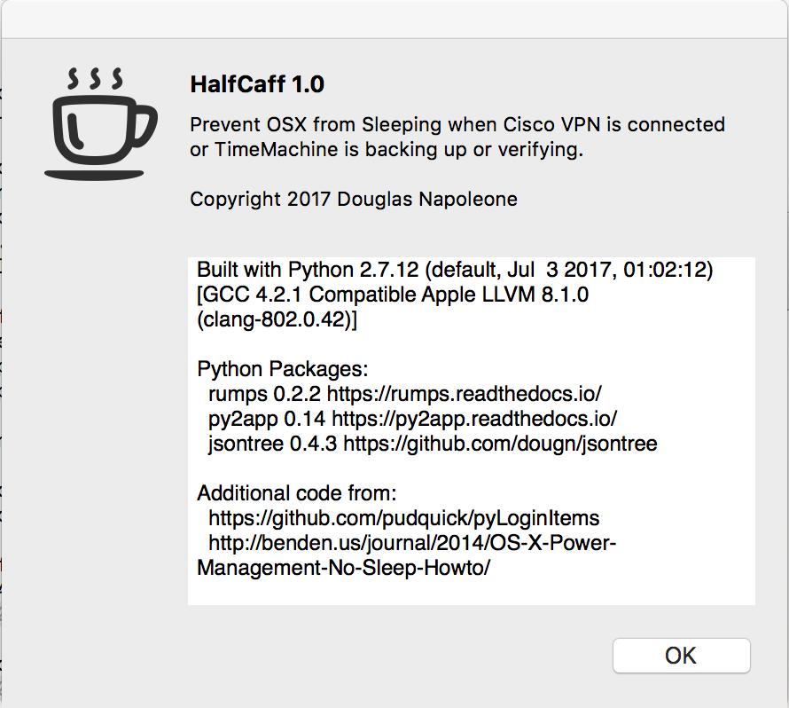

# HalfCaff   
OSX Status Bar app to keep laptop from sleeping when Cisco VPN is connected.

Building a full standalone app using [py2app](https://py2app.readthedocs.io/) can be complicated. 
For that reason a fully standalone version of the app is
released in the project and can be downloaded here: 
[HalfCaff-0.1.zip](https://github.com/dougn/HalfCaff/raw/master/release/HalfCaff-0.1.zip).
The only dependency is having Cisco AnyConnect installed.
You can download, unzip, and move HalfCaff.app to your Applications folder to install. 
HalfCaff has been tested on OSX 10.10 through OSX 10.12, but should work with older OSX 10 systems.

 


The Cisco Anyconnect VPN app with RSA token authentication has a problem. 
It does not change the sleep setting on OSX when connected and as a result, when the machine sleeps
VPN is disconnected. This can be a real pain with the 2FA token.

There are plenty of tools (Cafeine, caffeinate, etc) which will work on the commandline or provide a nice status bar
for setting the amount of time to keep the system awake for, but none which will monitor network activity or provide 
a plugin interface. This started as an excuse to learn [rumps](https://rumps.readthedocs.io/), 
[py2app](https://py2app.readthedocs.io/), and accessing Coacoa from python using 
[pyobjc](https://pypi.python.org/pypi/pyobjc), 
but quickly developed into a fully functional application.

HalfCaff will detect when a VPN connection is active, and provide the option to keep the system from entering
idle, but will still have the screen turn timeout and lock. When the VPN connection ends, or is dropped due to 
remote side issues, HalfCaff will detect this and disable the idle sleep protection. 

The only subprocess work is for checking the VPN connection status which uses the Cisco VPN client application. 
This is polled ever 2.5 minuites, and this polling interval can be configured. This interval was selected to 
ensure that a new VPN connection would be detected before the default idle sleep period would be encountered. 
All other system interactions are performed directly through Coacoa, AppKit, IOKit and the Framework pyobjc interfaces.

## Options

There are options to 'auto-enable' the idle sleep prevention on VPN conneciton, and for starting HalfCaff on login. 
Options are presistent and stored in 
~/Library/Application Support/HalfCaff/options.json

There are two hidden options only available in the json file, the vpn client path, and the polling inerval:

```json
{"vpncli": "/opt/cisco/anyconnect/bin/vpn", 
 "monitor_interval": 150, 
 "auto_caffeinate": false}
```

You can see the sleep prevention in action using pmset:

```bash
$ pmset -g assertions
2017-07-03 01:38:38 -0400 
Assertion status system-wide:
   BackgroundTask                 0
   ApplePushServiceTask           0
   UserIsActive                   1
   PreventUserIdleDisplaySleep    0
   PreventSystemSleep             0
   ExternalMedia                  0
   PreventUserIdleSystemSleep     1
   NetworkClientActive            0
Listed by owning process:
   pid 51669(HalfCaff): [0x000f6e9d0001a347] 00:00:15 NoIdleSleepAssertion named: "HalfCaff - VPN live connection" 
   pid 96(hidd): [0x000f56ca0009a096] 01:41:53 UserIsActive named: "com.apple.iohideventsystem.queue.tickle.4295159470.11" 
	Timeout will fire in 595 secs Action=TimeoutActionRelease
Kernel Assertions: 0x100=MAGICWAKE
   id=504  level=255 0x100=MAGICWAKE mod=7/2/17, 3:47 PM description=en0 owner=en0
Idle sleep preventers: IODisplayWrangler
```

The "Run at Startup" integrtation works with the Users & Groups system Preferences pane, and will detect when it is changed there.


## Building HalfCaff

You will need python2.7. The python which ships with OSX is sufficient for building, but may not be able to build a fully
standalone applicaiton due to the limitations of py2app. This should not be an issue as long as you install required
python packages into the system Python, however that version of HalfCaff.app will not be transferable to other machines.

The python packages requires for building are listed in requirements.txt, which you use pip to install.

```sh
$ pip install -r requirements.txt
$ python setup.py py2app
$ open dist/HalfCaff.app
```

### Building fully standalone HalfCaff (all dependencies built-in)

HalfCaff currently requires python2.7. To build a fully standalone version of HalfCaff you will 
also need to build a custom local Python2.7 release from source, either using Brew or by hand. 
You may need to custom build OpenSSL as well. HalfCaff does not use or package any of the SSL systems, 
but pip, setup tools, and other python tools used as part of building HalfCaff do. 
A fully standalone build is not required, however if you do build with a virtualenv, you must keep that virtualenv
on the system for the HalfCaff application to work, and it can not be moved to a new location. You may also be required
to start HalfCaff in a shell with the virtualenv activated. Installing the required packages listed in requirements.txt
into your system python will solve this issue instead of using a virtualenv.

Instructions on how to do this are not included, and are rather complicated. 
The binary included in the release directory is a fully standalone HalfCaff.app built with a custom build of Python2.7.12.


